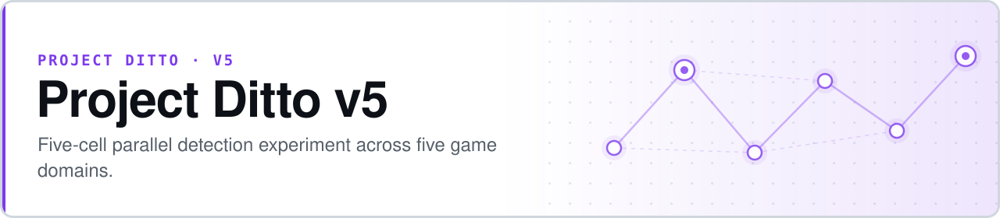

<p align="center">
  <picture>
    <source media="(prefers-color-scheme: dark)" srcset="assets/banner-dark.svg">
    
  </picture>
</p>

# Project Ditto v5 — Five-Cell Parallel Detection

**Run the same detection experiment across five unrelated game domains at once, and the failures stop looking like noise.**

v5 replicates v3's constraint-chain detection methodology across five new domains in parallel, on Claude Haiku 4.5. Running the cells side by side rather than sequentially is what makes the headline finding visible: model performance does not degrade smoothly across domains, it falls into **four discrete tiers**.

- **Five domains, one frozen methodology** — differences between cells are domain effects, not design drift
- **A 4-tier representational hierarchy** — 4 of 5 cells clear Bonferroni at α/5 by many orders of magnitude
- **Every decision is on the record** — `DECISION_LOG.md` runs D-0 → D-45 with default, alternative, and reversibility for each
- **Reproducible without the API** — 23,998 raw batch records are committed, so the headline numbers recompute offline

[](https://github.com/safiqsindha/Ditto-V5/actions/workflows/v5-tests.yml)


**[Status](STATUS.md)** · **[Closeout memo](MEMO.md)** · **[Decision log](DECISION_LOG.md)** · **[Spec](SPEC.md)** · **[Build plan](BUILD_PLAN.md)** · **[Release `v5.0`](https://github.com/safiqsindha/Ditto-V5/releases/tag/v5.0)**

> **Status: ✅ closed 2026-04-30.** Phase D complete at n = 1,200 chains/cell, results locked, total spend ≈ $5. Methodology paused for cross-model replication, which is scoped separately as [v5.1](https://github.com/safiqsindha/Ditto-5.1).

```bash
pip install -r requirements.txt
python -m pytest tests/
python run_pilot.py                     # mock data, no API calls
```

## Headline finding — a 4-tier hierarchy

| Cell | Δ Det@Int | *p*<sub>Bonferroni</sub> | Tier |
|---|---:|---:|---|
| `nba` | **+42.6%** | 5.2e-112 | 1 — aligned |
| `csgo` | **+32.9%** | 9.2e-87 | 2 — partial-observability |
| `pubg` | **+24.1%** | 1.1e-63 | 1 — aligned |
| `rocket_league` | +5.9% | 4.9e-16 | 3 — misaligned |
| `poker` | −0.1% | 1.000 | 0 — saturated / ceiling |

The tiers are not a ranking of difficulty. They describe *how* the model's internal representation of a domain relates to the constraint chain it is shown: aligned domains where the chain matches what the model already tracks, partially-observable domains where it does not, misaligned domains where the chain describes the wrong things, and saturated domains where the task is at ceiling and there is nothing left to detect.

## Domains

| Cell | Domain | Data source | Sample target |
|---|---|---|---|
| `pubg` | PUBG sample matches (squad-fpp / solo-fpp) | PUBG Developer API telemetry | 25 matches (smoke) → 80+ full |
| `nba` | 2023–24 regular season | NBA Stats API (PlayByPlayV3) | 300 games |
| `csgo` | 2024 S-tier (CS2) | HLTV demo archive + awpy | 150 maps |
| `rocket_league` | RLCS 2024 | BallChasing.com + rrrocket | 250 replays |
| `poker` | NLHE — HandHQ + WSOP 2023, all-human | PHH Dataset v3 | 3,500 hands |

### Amendments, and why domains changed

Three domains were swapped mid-programme. Each swap is recorded rather than quietly applied:

| # | Change | Reason |
|---|---|---|
| **A1** | Hearthstone → Poker | HSReplay access friction; PHH Dataset v3 is open |
| **A2** | Fortnite → PUBG | Epic locked down public CDN chunk access; PUBG offers a documented public API ([D-35](DECISION_LOG.md), [D-36](DECISION_LOG.md)) |
| **A3** | Poker corpus Pluribus → HandHQ | Pluribus hands seat Facebook's superhuman bot in 1 of 6 seats, contaminating ~17% of actions; switched to anonymized human cash games + WSOP 2023 ([D-37](DECISION_LOG.md)) |

A3 is the one worth reading. Leaving Pluribus in would have meant measuring a model's ability to detect *bot* play in a corpus labelled as human.

## The mid-experiment pivot

The original consistency-rating framing produced a **floor effect on 4 of 5 cells** — the model rated almost everything the same way, and there was no variance left to detect. v5 pivoted to a violation-detection diagnostic, then layered on derived-state markers, strict grounding, and a chain-of-thought false-positive analysis (D-42 → D-44) before scaling to the full pre-registered n = 1,200/cell in Phase D.

Pivoting mid-experiment is only defensible because the pivot preceded the scaled run and is documented in the decision log with its alternatives. The Phase D numbers above come from the post-pivot design, not from re-scoring the floor-effect data.

## Reproducing the headline numbers

```bash
.venv/bin/python synthesize_phase_d.py           # → RESULTS/phase_d_final.json + console table
.venv/bin/python run_phase_d_cot.py --cells nba csgo    # Layer-2 CoT diagnostic on residual FPs
```

If the 60-day Anthropic batch retention has expired, the raw responses are archived locally at `RESULTS/phase_d_raw_batches/*.jsonl` — point `fetch_batch` in `retrieve_phase_d_partial.py` at those files instead of the API.

## What's implemented

- Five data-acquisition pipelines with real-fetch and mock fallback
- Five domain event extractors with derived-state markers (D-43)
- Five translation functions T, plus per-cell `PromptBuilder` and `_MarkerSurfacing` (A4–A6)
- Per-cell violation injectors for the violation-detection diagnostic (D-42)
- Statistical harness: McNemar with continuity correction, exact binomial when n_disc < 25, Bonferroni, bootstrap CI
- Anthropic Batches caller with positional `custom_id` integrity
- Phase D entry point with strict grounding (D-44 Layer 1), Layer-2 CoT diagnostic, synthesis pipeline, and raw batch archival

**Tests: 415 passing.** Nine pre-existing failures in Fortnite and CS:GO mock tests are tracked in [#5](https://github.com/safiqsindha/Ditto-V5/issues/5) and are unrelated to the v5 results.

## Read these first

| File | Purpose |
|---|---|
| [`STATUS.md`](STATUS.md) | End-state status — Phase D closed, results locked |
| [`MEMO.md`](MEMO.md) | Closeout memo and bridge document for the eventual V1–V5.1 preprint |
| [`DECISION_LOG.md`](DECISION_LOG.md) | D-0 → D-45, every methodology decision with alternatives and reversibility |
| [`SPEC.md`](SPEC.md) | Pre-registered specification, signed 2026-04-27, 7 amendments adopted |
| [`docs/REAL_DATA_GUIDE.md`](docs/REAL_DATA_GUIDE.md) | Credentials and real-data acquisition |

## Repository layout

```
run_pilot.py            pilot validation entry point
run_eval.py             Phase D evaluation entry point
config/
  cells.yaml            per-cell sample targets, stratification, env vars
  harness.yaml          statistical harness parameters
src/
  common/               GameEvent, EventStream, ChainCandidate, config loader
  harness/              McNemar, scoring, variance, ACTIONABLE_TYPES, cell runner
  interfaces/           TranslationFunction and ChainBuilder ABCs
  cells/                one directory per domain: pipeline.py + extractor.py
  pilot/                MockT, PilotValidator, render_report
data/                   raw/ · processed/ · events/   (gitignored)
RESULTS/                pilot reports, evaluation outputs, archived raw batches
tests/                  pytest suite
```

## Deferred to v5.1 and beyond

- **v5.1 — cross-model replication.** Frozen Phase D prompts replayed across Anthropic, OpenAI, Google and open-weights models via OpenRouter, with derived-state-marker ablation as a second axis. Pre-registered design in `MEMO.md` §6. → [Ditto-5.1](https://github.com/safiqsindha/Ditto-5.1)
- **v5.2 — CS:GO awpy fix.** Adds bomb-site observability from parsed CS2 demos. Deliberately sequenced *after* cross-model work so capability and observability stay separable.
- **v5.2 — Rocket League per-event extraction** via carball / boxcars-py. Same deferral logic.
- **v6 — chain-length sweep and reasoning-mode toggles.** Open candidates.

## The Ditto program

| Version | Domain | Headline |
|---|---|---|
| [v1](https://github.com/safiqsindha/Project-Ditto) | Pokémon Showdown telemetry | Sonnet +0.206 · Haiku +0.066 |
| [v2](https://github.com/safiqsindha/Project-Ditto-v2) | Programming agent trajectories | Partial reproduction |
| [v3](https://github.com/safiqsindha/Project-Ditto-V3) | Chess · Chess960 · checkers · draughts | Phase 1 complete, paused at Gate 8 |
| [v4](https://github.com/safiqsindha/Project-Ditto-V4) | Pokémon, as a methodology control | +0.131, strong-positive |
| [v4.5](https://github.com/safiqsindha/Ditto-V4.5--DeepSeek-Flash-test) | DeepSeek V4 Flash cross-model probe | Scoping stub |
| **v5** ⟵ *you are here* | **PUBG · NBA · CS:GO · Rocket League · poker** | **4-tier hierarchy, closed** |
| [v5.1](https://github.com/safiqsindha/Ditto-5.1) | 22-model cross-provider panel | Near-chance across the panel |
| [v5.2](https://github.com/safiqsindha/Ditto-5.2-diagostic) | Diagnostic kit for the v5.1 null | Pre-registered, in progress |
| [v5.4](https://github.com/safiqsindha/DITTO-V5.4-OLAT) | 24 inference levers, two DeepSeek models | 6 meaningful conditions |

## License

MIT. No license file is currently committed to this repository.
